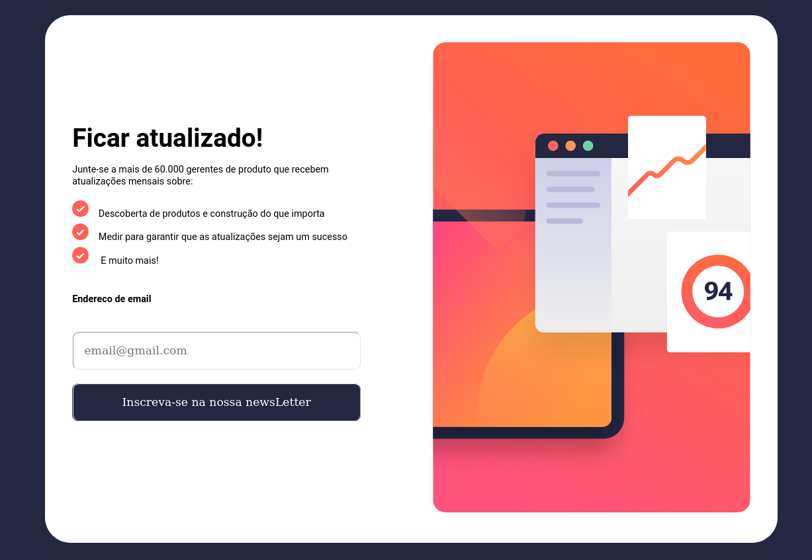

# Frontend Mentor - Formulário de inscrição em boletim informativo com solução de mensagem de sucesso

Esta é uma solução para o [formulário de inscrição em boletim informativo com desafio de mensagem de sucesso no Frontend Mentor](https://www.frontendmentor.io/challenges/newsletter-signup-form-with-success-message-3FC1AZbNrv). Os desafios do Frontend Mentor ajudam você a melhorar suas habilidades de codificação através da construção de projetos realistas.

## Índice

- [Visão geral](#Desenvolver e aprimorar minhas habilidades como desenvolvedor frontend !)
   - [O desafio](#construir um formulario onde o usuario insere seu email e quando clicado no botao receba uma mensagem de sucesso, ou mensagens de erro caso algo de errado)
   - [Captura de tela](#captura de tela)
   - [Links](#links)
- [Meu processo](#meu-processo)
   - [Construído com](#construído com)
   - [O que aprendi](#o que aprendi)
   - [Desenvolvimento contínuo](#desenvolvimento contínuo)
   - [Recursos úteis](#useful-resources)
- [Autor](#autor)
- [Agradecimentos](#agradecimentos)

**Observação: exclua esta nota e atualize o índice com base nas seções que você mantém.**

## Visão geral

### O desafio

Os usuários devem ser capazes de:

- Adicione o e-mail e envie o formulário
- Veja uma mensagem de sucesso com seu e-mail após enviar o formulário com sucesso
- Veja mensagens de validação de formulário se:
   - O campo fica vazio
   - O endereço de e-mail não está formatado corretamente
- Veja o layout ideal da interface dependendo do tamanho da tela do dispositivo
- Veja os estados de foco e foco para todos os elementos interativos na página

### Captura de tela




###Links

- URL da solução: [Adicione o URL da solução aqui](https://your-solution-url.com)
- URL do site ativo: [Adicione o URL do site ativo aqui](https://your-live-site-url.com)

## Meu processo

### Construído com

- Marcação HTML5 semântica
- Propriedades personalizadas CSS
- Caixa flexível
- Flexbox CSS
- Fluxo de trabalho voltado para dispositivos móveis


### O que eu aprendi

Nesse projeto pude por em pratica meus conhecimentos basicos de html, css e javascript, preferencialmente sobre o javascript, na manipulacao da API do dom e usos de metodos nativos da linguagem, como o uso do classList, onde a pouco tempo eu sentia dificuldade ao usar essas funcionalidades da linguagem, segue abaixo alguns exemplos.

```js
form.addEventListener("submit", function(event) {
    event.preventDefault();
    if(input.value === "") {
        erro.innerHTML = "este campo nao pode ficar vazio";
        erro.fontSize = "12px";
        erro.style.color = "red";
        console.log("campo vazio")
    } else if(regexEmailGmail.test(input.value) != true) {
        erro.textContent = "formato de email incorreto !!"
    } else {
        dashboard.classList.remove("none");
        dashboard.classList.add("block");
        main.classList.add("none");
        sucessMensage.innerHTML = `Um email de confirmação foi enviado para
        ${input.value}. Por favor, abra-o e clique no botão dentro para
        Confirme sua inscrição.`;
        console.log("form capturado com sucesso")
        input.value = "";
    }
    erro.style.color = "red";
})

```

### Desenvolvimento contínuo

Contudo pretendo continuar a praticar cada vez mais conceitos basicos das tecnologias principais no desenvolvimento frontend, treino de logica de programacao, estilos e estruturas dos conteudos das paginas, para que assim eu sinta algum conforto quando tiver que lidar com ferramentas mais modernas avancadas e complexas dessa stack principal do frontend.

